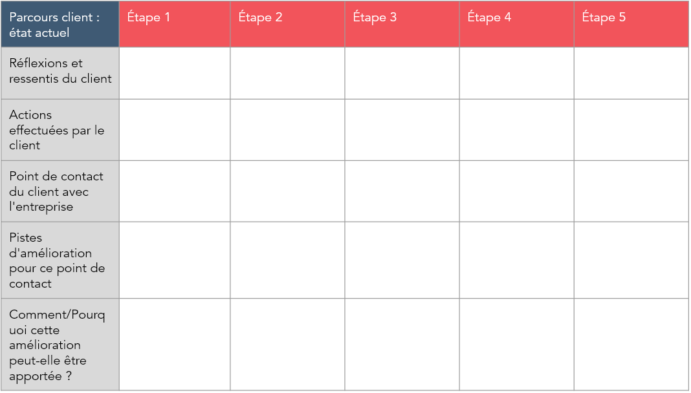

[#third_slide_cadrage]
= Cadrage

== Atelier 1 : Vision

== Atelier 2: Personas/Parcours utilisateurs
.Définir pour chaque persona un parcours utilisateur:
* Qui va utiliser mon service? (Cible)
* Que veut-il faire ? (But)
* Comment va t-il faire ? (Parcours Utilisateur)

link:06_exercice_topic_presentation_slide_02.adoc#second_slide_cadrage[[<-\]]
link:06_exercice_topic_presentation_slide_04.adoc#fourth_slide_cadrage[[->\]]
