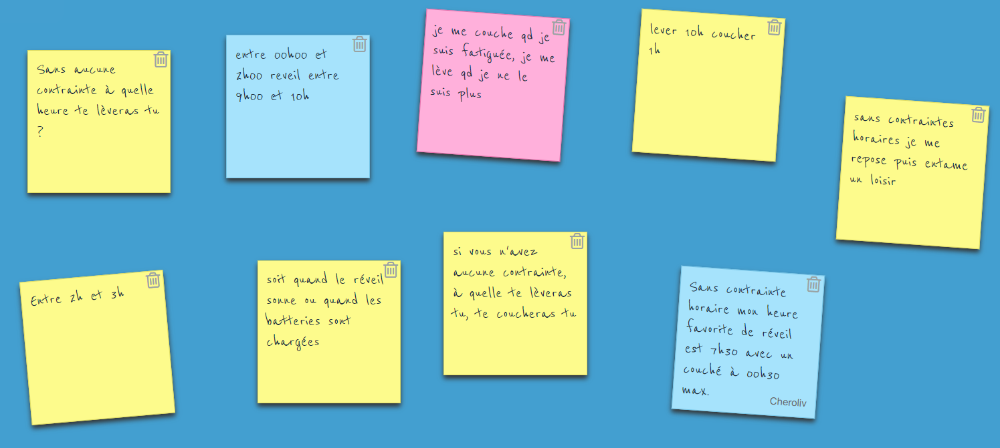

[#colab]
= Les outils professionnelles du formateur

link:../README.adoc#toc[Table des matieres] +
link:Seance_4_Presentation.pdf[Séance 4 Presentation]

== Compétences numériques

link:https://pix.fr/[site pix]

== Supports
* Discord
* social networks

== Prospecter, montrer ses compétences

=== A qui vais je m'adresser?

==== La liste de contacts

== Le CV du formateur pour adultes

== Le portfolio/site perso de présentation

== Receuillir les besoins d'un prospect pour analyser
* QQOQCP
* REAC
* analyse arborescente: Formaliser le besoin, définir les compétences visees, définir le programme
* matrice compétences/séquences
* mindmap

[#colab_exo]
== Que met on dans un CV de formateur?
répondre à cette question en 3 slides.
link:02_exercice_cv_formateur_slide1.adoc#resume_slide_1[exercice]

== youtube mon support de veille technologique:
* follow
* activate notification
* create and save playlist

== Etude de cas: Data visualisation

=== link:SPG_Data_visualisation.pdf[Scénario Pédagogique Global = SPG]

=== link:SPD_Data_visualisation.pdf[Scénario Pédagogique Détaillé = SPD]

[#learn2learn]
== Apprendre à apprendre: Les outils pour optimiser l'apprentissage

link:Document_de_travail_l_attention_les_mémoires.odp[présentation de la séance]

=== Quatre grandes phases de l'apprentissage
. inconscience de la compétence
. conscience de l'incompétence
. apprentissage de la compétence
. acquisition de la compétence(automatisme)

=== fonctions cognitive de l'apprentissage

=== L'attention comme condition d'apprentissage

. l'attention soutenue
. l'attention sélective  (par inhibition/abstraction)
.. stimulus peripherique
.. les automatismes existants (désapprendre)
. l'attention partagée

=== La compréhension

=== Les types de mémoires

link:https://fr.wikipedia.org/wiki/Malcolm_Knowles[Malcolm Knowles] (1913-1997)

[#time_learn]
== Temps et apprentissage

link:Fiche_activites__Seance_5.docx[présentation de la séquence]

[#learning_styles]
== Les Styles d'apprentisage

link:Activite_seance_4___Les_styles_dapprentissages.docx[présentation de la séquence]

complément de documentation:

. link:Les_styles_dapprentissage___entre_flou_conceptuel_et_interet_pratique.pdf[entre_flou_conceptuel_et_interet_pratique]
. link:lutilite_des_styles_dapprentissages_VAK.pdf[l'utilité des styles d'apprentissages VAK]

. link:Test_les_styles_dapprentissage_de_Kolb.xlsx[test de Kolb]

link:Bilan_periode_de_remise_a_niveau.docx[bilan de séance]

== Métacognition et analyse reflexive
. Ce que j'ai fait?
. Ce que j'aurais du faire?
. Points d'amélioration

link:Comment_mettre_en_place_une_pratique_reflexive_le_cycle_reflexif.pdf[Comment mettre en place une pratique reflexive: le cycle reflexif]

link:../README.adoc#toc[Table des matieres]
====
link:https://cheroliv.github.io[*cheroliv*] | &copy; 2019-2023 | link:http://creativecommons.org/licenses/by-nc-sa/4.0/[Licence Creative Commons BY-NC-SA] image:https://licensebuttons.net/l/by-nc-sa/4.0/88x31.png[Creative Commons License]
====