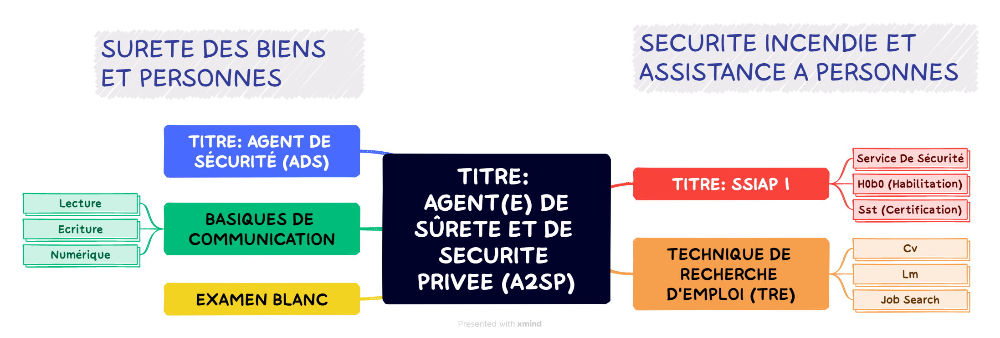

= Scénario pédagogique global (SPG): A2SP - AGENT(E) DE SÛRETE ET DE SECURITE PRIVEE

[[toc]]
.*Sommaire*
. xref:theme[Thème]
. xref:title[Titre]
. xref:prez[Présentation et description]
.. xref:mindmap[Carte thématique]
. xref:public[Public]
. xref:prerequiz[Pré-requis et conditions d’accès à la formation] (Qualiopi)
. xref:objs[Objectifs pédagogiques] (Qualiopi)
. xref:competences[Compétences visées] (Qualiopi)
. xref:timing[Durée (Temporisation)] (Qualiopi)
. xref:means[Moyen d’accompagnement et Suivi pédagogique] (Qualiopi)
. xref:prgm[Programme pédagogique (Modalités pédagogiques)] (Qualiopi) : du contenu et du séquencement
. xref:eval[Modalités d’évaluations] (Qualiopi)
. xref:certif[Modalités de certification et Certification visé] (Qualiopi)
. xref:place[Lieux] (Qualiopi)
. xref:price[Tarifs]
. xref:infra[Moyens logistiques et matériels] (Qualiopi)
. xref:pursuit[Poursuite en formation] (Qualiopi)
. xref:access_time[Délais d’accès] (Réglementaire)
. xref:mobility[Accessibilité et Handicap] (Qualiopi)
. xref:testimony[Témoignage Evaluation de la formation] (Qualiopi)
. xref:testimony_customer[Témoignage apprenant/commanditaire]

.Réfèrence :
* link:https://www.afpa.fr/formation-qualifiante/agent-de-surete-et-de-securite-privee[A2SP AFPA]
* link:https://www.francecompetences.fr/recherche/rncp/34507/[REAC A2SP]

[[theme]]
== 1. Thème (Qualiopi)

**Sécurité incendie, assistance à personne et sûreté des personnes et des biens**

La sécurité incendie, l'assistance à personne et la sûreté des personnes et des biens sont des domaines complémentaires qui visent à protéger les personnes et les biens des risques, dans des lieux recevant du public ou des travailleurs.

**Sécurité incendie**

La sécurité incendie vise à prévenir et à lutter contre les incendies. Elle comprend des mesures de prévention, telles que l'installation d'extincteurs et de détecteurs de fumée, et des mesures d'intervention, telles que la formation des salariés à l'évacuation des locaux.

**Assistance à personne**

L'assistance à personne vise à venir en aide aux personnes en situation de danger. Elle comprend des activités de prévention, telles que l'information et la sensibilisation des publics, et des activités d'intervention, telles que les secours d'urgence.

**Sûreté des personnes et des biens**

La sûreté des personnes et des biens vise à protéger les personnes et les biens des risques d'agression, de vol ou de vandalisme. Elle comprend des mesures de prévention, telles que l'installation de caméras de surveillance et de systèmes d'alarme, et des mesures d'intervention, telles que les équipes de sécurité.

Ces trois domaines sont essentiels pour garantir la sécurité des personnes et des biens. Ils nécessitent une expertise et une formation spécifiques.

**Métiers**

Voici quelques exemples de métiers liés à ces domaines :

* *Sécurité incendie* : pompier, sapeur-pompier professionnel, agent de sécurité incendie, technicien de maintenance incendie
* *Assistance à personne* : pompier, sapeur-pompier professionnel, secouriste, infirmier, ambulancier, psychologue, assistant social
* *Sûreté des personnes et des biens* : agent de sécurité, vigile, gardien d'immeuble, agent de prévention, agent de sûreté, agent de sécurité incendie

Ces métiers sont à la fois variés et passionnants. Ils offrent de nombreuses opportunités de carrière dans un domaine à forte tension.

xref:toc[sommaire]

[[title]]
== 2. Titre (Qualiopi)
Agent de sûreté et de sécurité privée +
Niveau 4 (Cadre national des certifications 2019)

xref:toc[sommaire]

[[prez]]
== 3. Présentation & description

La formation Agent de sûreté et de sécurité privé est un métier original qui regroupe plusieurs certifications reconnues par l'état pour une meilleure insertion professionnelle. +
Le titre A2SP est au cœur de la sécurité incendie, mais il embrasse également les préoccupations de sûreté, offrant ainsi une approche intégrée de la protection des personnes et des biens.
Cette complémentarité renforce la sécurité des établissements et ouvre des opportunités professionnelles diverses pour les spécialistes de la sécurité, de la maintenance des outils incendies, télésurveillance. +
L'agent agit à prévenir et gérer les risques liés aux incendies dans les établissements recevant du public. +
Cette mission est piloté depuis le PCS(poste centrale de sécurité) où il y a aussi des préoccupations de sûreté, contribuant ainsi à la sécurité globale de ces lieux. +
La certification SSIAP 1 et ADS sont une base solide pour aborder la question de la sûreté. Les professionnels de SSIAP 1 sont formés à identifier les situations potentiellement dangereuses, à gérer les accès aux bâtiments, à surveiller les systèmes de sécurité, et à coopérer avec les forces de l'ordre en cas de menaces ou d'incidents liés à la sûreté. Ils assurent la protection des personnes, des biens, et des informations sensibles. +
L'un des avantages majeurs de la complémentarité entre la sécurité incendie et la sûreté réside dans la capacité à gérer de manière proactive +
et intégrée les risques. Les agents A2SP sont formés pour réagir efficacement en cas d'incendie, +
mais ils peuvent par ailleurs contribuer à la prévention des actes malveillants et des situations d'urgence liées à la sûreté. +
En intégrant ces deux domaines de la sécurité, les établissements assurent une protection plus globale et renforcent la sécurité de leurs occupants. +
Les évolutions professionnelles possibles pour les titulaires de la certification SSIAP 1 incluent non seulement des avancements dans la sécurité incendie, +
mais aussi des opportunités de carrière dans le domaine de la sûreté, comme la sécurité privée, la gestion de crise, ou la prévention des risques liés aux menaces. +
La polyvalence de ces professionnels les rend précieux pour les employeurs soucieux de garantir une sécurité complète.

[[mindmap]]
=== Carte thématique A2SP

xref:toc[sommaire]

[[public]]
== 4. Public (Qualiopi)
Tout public +
Effectif entre 10 et 20 apprenants.

xref:toc[sommaire]

[[prerequiz]]
== 5. Pré-requis et conditions d’accès à la formation (Qualiopi)
. Maîtriser la langue française est indispensable, à l'oral et à l'écrit, pour la
compréhension et pour l'expression. Un résultat de niveau B1 au CECRL est requis.
Pour les ressortissants d'un Etat membre de l'Union européenne ou d'un Etat partie à
l'accord sur l'Espace économique européen ou les ressortissants d'un pays tiers, ils
doivent justifier d'un niveau de maîtrise de la langue française tel spécifié dans l'arrêté du
31 mars 2022.
. Présenter une autorisation préalable d’accès à la formation délivrée par le CNAPS (pour
laquelle les ressortissants étrangers non européens doivent justifier de 5 années de
résidence continue et régulière sur le territoire, attestées par un ou plusieurs titres de
séjour.) L’autorisation est matérialisée par un numéro personnel.
. Justifier de son aptitude physique attestée par un certificat médical de moins de 3 mois
pour pouvoir se former et se présenter au SSIAP 1.
Nota bene : Il est possible de bénéficier d’une adaptation de parcours si :
* Le candidat est titulaire du SST, en cours de validité
* Le candidat est détenteur d’un avis de formation initiale ou attestation de formation de
recyclage du BS-BE manœuvre,
* Le candidat est détenteur du diplôme SSIAP 1, en cours de validité, et si nécessaire, des
attestations de recyclage ou de remise à niveau.

xref:toc[sommaire]

[[objs]]
== 6. Objectifs pédagogiques (Qualiopi)

.**Sûreté, protection des biens et personnes**
* Connaître les procédures de sécurité et les réglementations en vigueur en matière de sûreté, protection des biens et personnes.
* Comprendre les protocoles de communication en cas d’urgence et les types de menaces courantes en matière de sécurité.
* Utiliser les protocoles de communication en cas d’urgence et décrire les types de menaces courantes en matière de sécurité.
* Comprendre le rôle et les responsabilités d’un agent en matière de sûreté, protection des biens et personnes.
* Analyser les menaces et les risques de manière proactive en matière de sûreté, protection des biens et personnes.

.**Sécurité incendie et assistance aux personnes**
* Connaître les causes, les conséquences et les moyens de prévention des incendies.
* Comprendre l'importance de la sensibilisation et de l'éducation en matière de sécurité incendie.
* Sensibiliser et éduquer les personnes en matière de sécurité incendie.
* Comprendre les principes de base de la maintenance élémentaire des équipements de sécurité incendie.
* Effectuer la maintenance élémentaire des équipements de sécurité incendie.
* Connaître les procédures d'alerte et d'accueil des secours en cas d'incendie.
* Alerter et accueillir les secours en cas d'incendie.
* Connaître les procédures d'évacuation du public en cas d'incendie.
* Evacuer le public en cas d'incendie.
* Connaître les techniques d'intervention précoce en cas d'incendie.
* Intervenir précocement en cas d'incendie.
* Connaître les techniques d'assistance aux personnes en cas d'incendie ou d'autres situations d'urgence.
* Assister les personnes en cas d'incendie ou d'autres situations d'urgence.
// ajouter francais basiques, tre, anglais, site sensible

xref:toc[sommaire]

[[competences]]
== 7. Compétences visés(objectifs opérationnels) (Qualiopi)

.**Sécurité incendie et assistance aux personnes**
* Effectuer l'entretien et les vérifications élémentaires des installations et équipements de sécurité
* Appliquer des consignes de sécurité
* Lire et manipuler des tableaux de signalisation
* Effectuer des rondes de sécurité et surveillance des travaux
* Assurer la surveillance au PC
* Passer des appels et réceptionner les services publics de secours
* Porter assistance à personnes

.**Sûreté, protection des biens et personnes**
** Surveillance et Patrouille
** Contrôle d'Accès
** Inspection et détection de Menaces
** Gestion des conflits et de l'agitation
** Formation Continue et Connaissance de la Législation

Des compétences spécifiques peuvent varier en fonction des besoins de l'entreprise ou du site où l'agent opère.

xref:toc[sommaire]

[[timing]]
== 8. Durée (Qualiopi)

.Durée de la formation : 210h
* Basiques de communication : 14h
* ADS : 56 heures + examen
* Technique de recherche d'emploi : 14h
* SST : 14h
* BS-BE manoeuvre : 14h
* SSIAP 1 : 90 heures + examen
* examen blanc : 7h

xref:toc[sommaire]

[[means]]
== 9. Moyen d’accompagnement/Suivis pédagogique (Qualiopi)

Formation multi-modulaire, individualisée, accompagnement personnalisé

.Moyens pédagogiques :
* Kit Pédagogique USB
* Documents écrits
* Diaporama
* Supports audio et visuels
* Outils multimédias(Quizz)

.Notre espace de formation dispose d’outils de formation modernes et performants comprenant :
- Des salles polyvalentes
- Des salles informatiques offrant l’accès à des plateformes numériques en ligne pour les professionnels de la securité
- Matériel audio-visuel : caméscope, vidéo projecteur...
- Ressources documentaires
- Plateau technique dédié qui reconstitue les conditions de réalisation des gestes professionnels; conforme aux RC des TP et CQP

.Équipe pédagogique
* Responsable pédagogique : John Doe, jdoe@acme.com, 0607080910
* Coordinateur pédagogique : Jane Doe, jane.doe@acme.com, 0611121314
* Référent handicap : Henri Smith, h.smith@acme.com, 0615161718
* Formateurs :
    - David Snow, d.snow@acme.com, 0619202122
    - Gwen Jones, g.jones@acme.com, 0623242526
    - Charly Brown, c.brown@acme.com, 0627282930

Selection à la formation après réunion d'information collective et entretien individuel.

// Détails de l'organisation des journées sur les différentes formules pour dispenser la formation +
// Planning jours bloc de competences
// mode de communication

xref:toc[sommaire]

[[prgm]]
== 10. Programme pédagogique : contenu et séquencement (Qualiopi)

[options="header"]
.Programme pédagogique
|==========================================================
| Jour & durée | Intitulé / objectif                   | Pré-requis / contexte | Modalités pédagogiques | Moyens, supports | Modalité d’évaluations | Constats et remédiations
|            2 jours  | Basiques de communication             | Aucun | Exercices, jeux de rôle | Salle de formation équipée, vidéoprojecteur, ordinateurs | QCM, exercices pratiques | Problèmes de compréhension : prévoir des exercices supplémentaires
|            8 jours  | ADS                                   | Aucun | Cours magistral, travaux pratiques | Salle de formation équipée, matériel de sécurité | QCM, exercices pratiques | Problèmes d'application : prévoir des exercices d'application plus concrets
|            2 jours | Technique de recherche d'emploi (TRE) | Aucun | Ateliers, simulations | Salle de formation équipée, ordinateurs | Simulation d'entretien d'embauche | Problèmes de confiance en soi : prévoir un accompagnement individualisé
|            2 jours  | Habilitation électrique (H0B0)        | Aucun | Cours magistral, travaux pratiques | Salle de formation équipée, matériel électrique | QCM, exercices pratiques | Problèmes de compréhension : prévoir des exercices supplémentaires
|            2  | Sauveteur Secouriste du Travail (SST) | Aucun | Cours magistral, travaux pratiques | Salle de formation équipée, matériel de secours | QCM, exercices pratiques | Problèmes de coordination : prévoir des exercices plus intenses
|            13 jours  | SSIAP 1                               | Aucun | Cours magistral, travaux pratiques | Salle de formation équipée, matériel de sécurité | QCM, exercices pratiques | Problèmes de compréhension : prévoir des exercices supplémentaires
|            1 jour  | Examen blanc                          | Aucun | QCM, exercices pratiques | Salle de formation équipée, matériel de sécurité | QCM, exercices pratiques | Problèmes de stress : prévoir un accompagnement individualisé
|==========================================================
.**Durée de la formation : 210h**

xref:toc[sommaire]

[[eval]]
== 11. Modalités d’évaluations (Qualiopi)

xref:toc[sommaire]

[[certif]]
== 12. Modalités de certification et Certification visé (Qualiopi)

xref:toc[sommaire]

[[place]]
== 13. Lieux (Qualiopi)
CFA - Union des travailleurs +
33 boulevard de Stalingrad +
92240 Malakoff

xref:toc[sommaire]

[[price]]
== 14. Tarifs
4704€ HT

xref:toc[sommaire]

[[infra]]
== 15. Moyens logistiques et matériels (Qualiopi)

xref:toc[sommaire]

[[pursuit]]
== 16. Poursuite en formation (Qualiopi)
Vous pouvez travailler directement et accéder à un poste d'encadrement en fonction de la
politique de l'entreprise. Vous pouvez poursuivre dans la filière sécurité privée en passant
les diplômes de management ou de prévention des risques (BTS éducation nationale), mais aussi de chef d'équipe SSIAP 2 ou 3, ainsi que d'une licence sécurité en université de droits.

xref:toc[sommaire]

[[access_time]]
== 17. Délais d’accès (Réglementaire)
Les délais de remise du titre sont de 15 jours minimum.

xref:toc[sommaire]

[[mobility]]
== 18. Accessibilité et Handicap (Qualiopi)
L'accessibilité est un sujet que nous favorisons, en préparant l'accès en formation aux apprenants avec des handicaps. Nous étudions individuellement avec notre référant les possibilités d'inclusion et d'insertion dans le domain professionnel de la sécurité et sureté. +
Notre référant handicape est à votre disposition pour toutes demandes sur l'accessibilité et l'employabilité des personnes en hadicapes

xref:toc[sommaire]

[[testimony]]
== 19. Témoignages évaluation de la formation (Qualiopi)

Apres la formation, nous recueillons les avis et impressions des apprenants sur la formation, dans un soucis d'amélioration continue, transparence avec l'organisme financeur et suivie d'activité professionnelle de l'apprenant.

xref:toc[sommaire]

[[testimony_customer]]
== 20. Témoignages apprenants/commanditaires

Le site internet du centre de formation met à disposition les retours d'experiencess d'apprenants et commanditaire pour leurs équipes.

xref:toc[sommaire]
