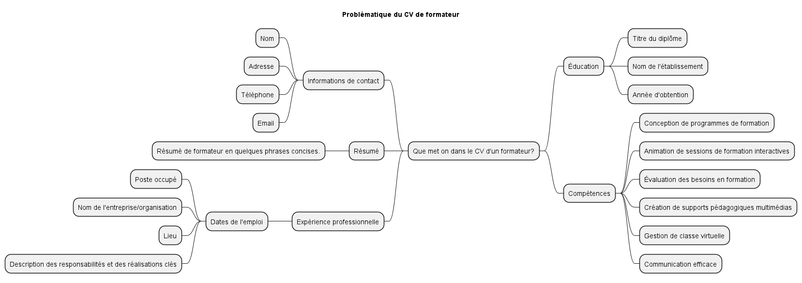

[#resume_slide_1]
= Exercice: le cv de formateur

Problématique: *Que met on dans le CV d'un formateur?*

* mindmap

link:01_les_outils_professionnelles_du_formateur.adoc#colab[&#11014;] +
link:03_exercice_cv_formateur_slide2.adoc#resume_slide_2[&#10145;]

====
link:https://cheroliv.github.io[*cheroliv*] | &copy; 2019-2023 | link:http://creativecommons.org/licenses/by-nc-sa/4.0/[Licence Creative Commons BY-NC-SA] image:https://licensebuttons.net/l/by-nc-sa/4.0/88x31.png[Creative Commons License]
====