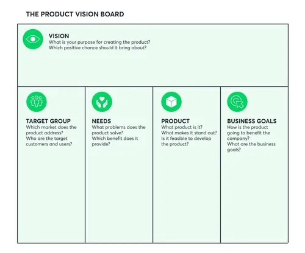
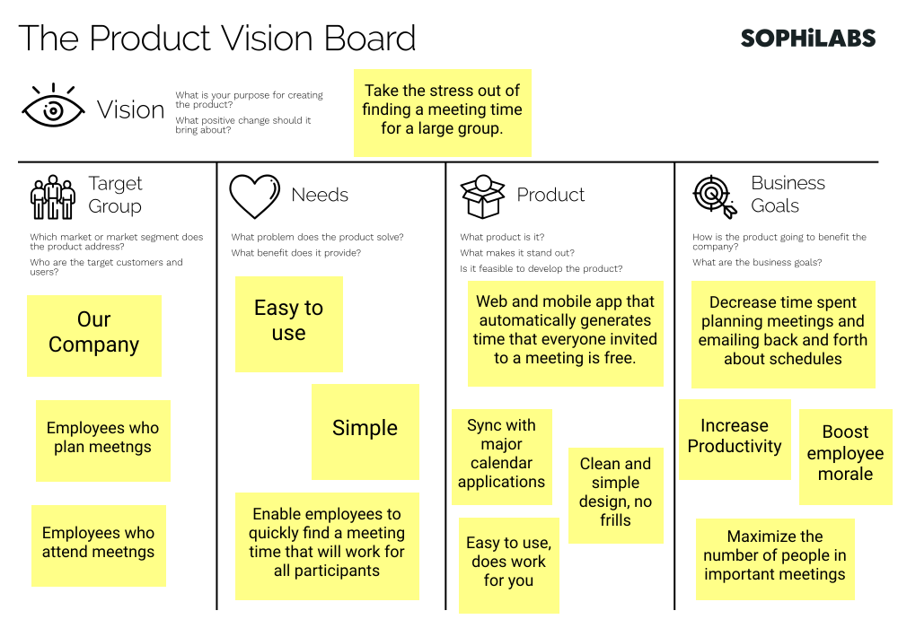

[#second_slide_cadrage]
= Cadrage

== Atelier 1 : Vision

=== 1. Le pattern “QQOQCP” – Qui, Quoi, Où, Quand, Comment, Pourquoi

=== 2. Le Product Vision Board

==== Target Group

Qui sont les utilisateurs qui utilisent le produit ou l’offre ? (direct, indirect)

==== Needs

Quels sont les 5 besoins principaux des utilisateurs clés de l’application ?

==== Product
Quelle est ma proposition de valeur ?
Quelles sont les 5 fonctionnalités principales du produit qui permettent de répondre aux
besoins

==== Business Goal
Quelles sont les critères de succès ?

==== Vision
Quand les 4 colonnes sont complètes, il vous faudra remplir la partie vision du Product Vision
Board en une phrase complète.

link:06_exercice_topic_presentation_slide_01.adoc#first_slide_cadrage[[<-\]]
link:06_exercice_topic_presentation_slide_03.adoc#third_slide_cadrage[[->\]]

====
link:https://cheroliv.github.io[*cheroliv*] | &copy; 2019-2023 | link:http://creativecommons.org/licenses/by-nc-sa/4.0/[Licence Creative Commons BY-NC-SA] image:https://licensebuttons.net/l/by-nc-sa/4.0/88x31.png[Creative Commons License]
====
