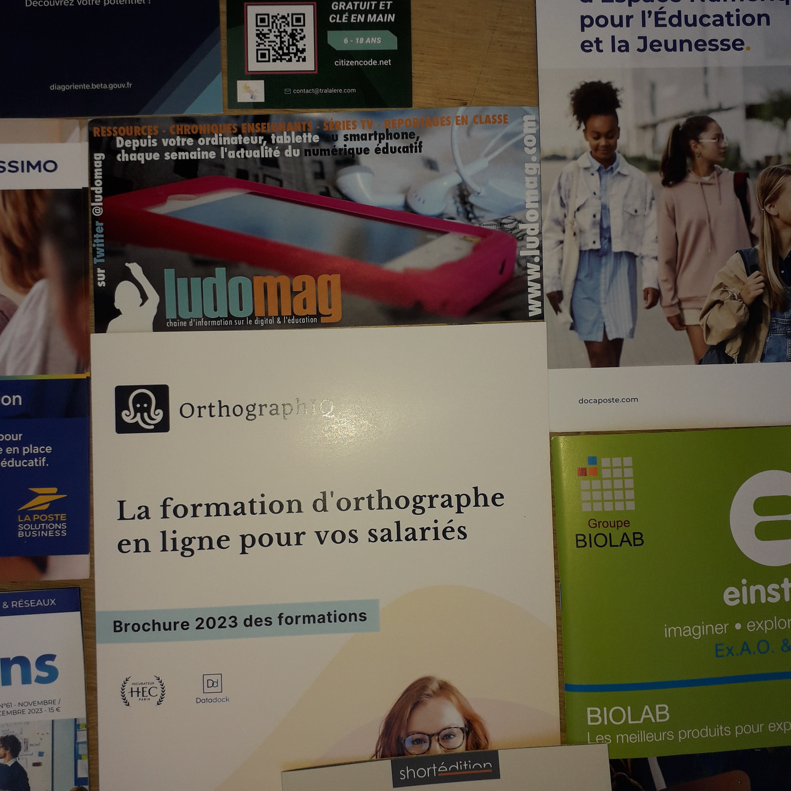
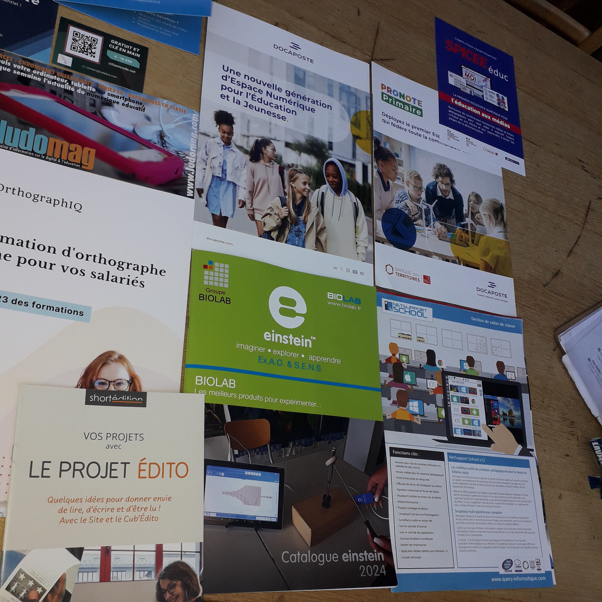

= Rapport de sortie du salon Educatech

Date: 2023-11-17 +
Lieu: Paris, Porte de Versailles +
Participant: Olivier +

== Résumé
_rapport de sortie pedagogique et mise en relation avec le projet pro._

Le vendredi 17 novembre 2023, j'ai visité le salon Educatech à Paris, Porte de Versailles. Le salon était ouvert aux professionnels de l'éducation et aux particuliers intéressés par les nouvelles technologies éducatives.

== Innovations technologiques

J'ai été particulièrement intéressé par les innovations technologiques qui sont en train de révolutionner l'éducation. Parmi les innovations qui ont retenu mon attention, on peut citer :

* **L'intelligence artificielle**, qui est utilisée pour personnaliser l'apprentissage, proposer des exercices de remédiation ou encore évaluer les compétences des élèves.
[Image of L'intelligence artificielle au salon Educatech]
* **La réalité virtuelle et la réalité augmentée**, qui permettent de créer des environnements d'apprentissage immersifs et interactifs.
[Image of La réalité virtuelle et la réalité augmentée au salon Educatech]
* **L'apprentissage en ligne**, qui permet aux élèves d'apprendre à leur rythme et en fonction de leurs besoins.

== Produits et services

J'ai également été impressionné par la diversité des produits et services proposés par les exposants. J'ai pu découvrir des solutions innovantes pour tous les niveaux d'enseignement, de la maternelle au supérieur.

Voici quelques-uns des produits et services qui ont retenu mon attention :

* **École Futée** propose une plateforme d'apprentissage personnalisée qui utilise l'intelligence artificielle pour proposer aux élèves des contenus adaptés à leurs besoins.
[Image of École Futée]
* **Spicee** propose une plateforme d'apprentissage collaborative qui permet aux élèves de travailler ensemble sur des projets.
[Image of Spicée]
* **Le projet Bien à l'École** propose un programme de prévention du décrochage scolaire qui utilise la réalité virtuelle.
[Image of Le projet Bien à l'École]
* **Les solutions de client lourd de Query-Informatique** proposent des solutions de gestion des ressources pédagogiques pour les établissements scolaires.
* **Humanum Canope Taralare** propose une plateforme d'apprentissage des langues qui utilise la réalité augmentée.
[Image of Humanum Canope Taralare]
* **Citizencode.net** propose une plateforme d'apprentissage du codage qui vise à sensibiliser les jeunes à la citoyenneté numérique.
* **Diagoriente.beta.gouv** propose un outil d'orientation scolaire et professionnelle qui utilise l'intelligence artificielle.
* **Ludomag.com** propose des jeux éducatifs numériques pour tous les âges.
* **Log'issimo du groupe La Poste** propose une plateforme de gestion des colis qui permet aux élèves de suivre le parcours de leurs colis.
* **Le projet Édito de Short-Edition.com** propose une plateforme de publication de livres numériques pour les jeunes auteurs.
* **Pronote et Docaposte** proposent des solutions de gestion administrative pour les établissements scolaires.
[Image of Pronote]
[Image of Docaposte]
* **SmartIntegrationsMag.com** propose des solutions de gestion des données pour les établissements scolaires.
* **Orthographiq.com** propose une solution d'aide à l'orthographe et à la grammaire.

== Application à mon projet de formation

Les éléments qui ont retenu mon attention au salon Educatech sont particulièrement intéressants pour mon projet de création d'organisme de formation dans la thématique de l'inclusion numérique, la sécurité et sureté incendie ainsi que le développement logiciel, design system, les réseaux et la cybersécurité.

En effet, ces innovations technologiques peuvent être utilisées pour créer des formations plus efficaces et plus adaptées aux besoins des apprenants. Par exemple, l'intelligence artificielle peut être utilisée pour personnaliser les parcours de formation, la réalité virtuelle et la réalité augmentée peuvent être utilisées pour créer des environnements d'apprentissage immersifs et interactifs, et l'apprentissage en ligne peut être utilisé pour offrir des formations flexibles et accessibles à tous.

Voici quelques exemples concrets de la façon dont ces innovations technologiques pourraient être utilisées dans mes formations :

* **L'intelligence artificielle** pourrait être utilisée pour :
* Identifier les besoins individuels des apprenants
* Proposer des parcours de formation personnalisés
* Évaluer les compétences des apprenants
* **La réalité virtuelle et la réalité augmentée** pourraient être utilisées pour :
* Simuler des situations réelles
* Permettre aux apprenants de vivre des expériences immersives
* Faciliter l'apprentissage de concepts complexes

