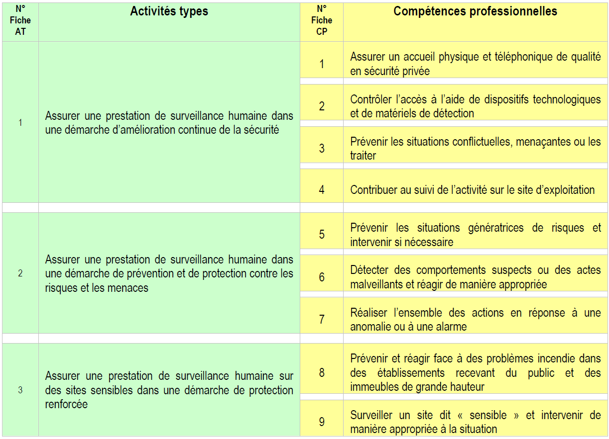

= Scénario pédagogique détaillé (SPD) : A2SP - AGENT(E) DE SÛRETÉ ET DE SÉCURITÉ PRIVÉE

== FICHE COMPÉTENCE PROFESSIONNELLE N°2 : Contrôler l’accès à l’aide de dispositifs technologiques et de matériels de détection

=== Vue synoptique de l'A2SP

.Le contrôle d'accès, sur 2 jours
* Premier jour : théorie et legislation, communication au talkiewalkie

* Deuxième jour :  mise en situation d'un point de contrôle d'accès

.*Activités types :*
Assurer une prestation de surveillance humaine dans
une démarche d’amélioration continue de la sécurité.

._Compétences professionnelles :_
- Contrôler l’accès à l’aide de dispositifs technologiques et de matériels de
détection

TODO : Jour & durée/Intitulé / objectif/Pré-requis / contexte/Modalités pédagogiques/"Moyens, supports"/Modalité d’évaluations/Constats et remédiations
