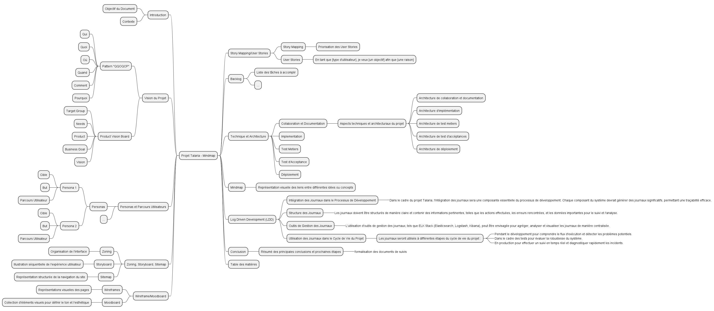

= Cadrage pour le Projet Talaria
@CherOliv
:jbake-title: Mémo Cadrage - Projet Talaria
:jbake-type: post
:jbake-tags: projet, cadrage, formation, Talaria
:jbake-status: draft
:jbake-date: 2024-01-01
:summary: Document de cadrage pour le projet Talaria - Organisme Formateur.
2024-01-01

== 1. Introduction
=== 1.1 Objectif du Document
Ce document a pour objectif de définir le cadre et les principales lignes directrices du projet Talaria, un organisme formateur.

=== 1.2 Contexte
Le projet Talaria vise à créér un OF multimodale remote-first.

== 2. Vision du Projet
=== 2.1 Pattern "QQOQCP"
- Qui : Définition des parties prenantes.
- Quoi : Objectifs et résultats attendus.
- Où : Lieux géographiques d'opération.
- Quand : Calendrier prévu du projet.
- Comment : Approche et méthodologie.
- Pourquoi : Justification et bénéfices attendus.

=== 2.2 Product Vision Board
==== 2.2.1 Target Group
==== 2.2.2 Needs
==== 2.2.3 Product
==== 2.2.4 Business Goal
==== 2.2.5 Vision

== 3. Personas et Parcours Utilisateurs
=== 3.1 Personas
- Persona 1
  - Cible
  - But
  - Parcours Utilisateur
- Persona 2
  - Cible
  - But
  - Parcours Utilisateur
- [... Ajouter autant de personas que nécessaire ...]

== 4. Zoning, Storyboard, Sitemap
=== 4.1 Zoning
- Organisation de l'interface.
L'organisation de l'interface du projet Talaria est définie comme suit...

=== 4.2 Storyboard
- Illustration séquentielle de l'expérience utilisateur.
Le storyboard illustre de manière séquentielle l'expérience utilisateur à travers...

=== 4.3 Sitemap
- Représentation structurée de la navigation du site.
La structure de navigation du site est représentée dans le sitemap comme suit...

== 5. Wireframe/Moodboard
=== 5.1 Wireframes
- Représentations visuelles des pages.
Les wireframes fournissent une représentation visuelle des pages clés du projet...

=== 5.2 Moodboard
- Collection d'éléments visuels pour définir le ton et l'esthétique.
Le moodboard rassemble des éléments visuels pour définir le ton et l'esthétique du projet...

== 6. Story Mapping/User Stories
=== 6.1 Story Mapping
- Priorisation des User Stories.
Le backlog du projet Talaria comprend les tâches suivantes...

=== 6.2 User Stories
- En tant que [type d'utilisateur], je veux [un objectif] afin que [une raison].

== 7. Backlog
- Liste des tâches à accomplir.
Le backlog du projet Talaria comprend les tâches suivantes...

== 8. Technique et Architecture
.Aspects techniques et architecturaux du projet.
- architecture de collaboration et documentation
- architecture d'implémentation
- architecture de test metiers
- architecture de test d'acceptance
- architecture de déploiment

== 9. Mindmap
- Représentation visuelle des liens entre différentes idées ou concepts.
La mindmap illustre visuellement les liens entre différentes idées ou concepts...

== 10. Log Driven Development (LDD)

=== 10.1 Objectifs du Log Driven Development
Le Log Driven Development (LDD) est une pratique visant à guider le développement en se basant sur les informations contenues dans les journaux (logs). Cela permet de mieux comprendre le comportement du système, d'identifier les problèmes potentiels et de faciliter le débogage.

=== 10.2 Intégration des Journaux dans le Processus de Développement
Dans le cadre du projet Talaria, l'intégration des journaux sera une composante essentielle du processus de développement. Chaque composant du système devrait générer des journaux significatifs, permettant une traçabilité efficace.

=== 10.3 Structure des Journaux
Les journaux doivent être structurés de manière claire et contenir des informations pertinentes, telles que les actions effectuées, les erreurs rencontrées, et les données importantes pour le suivi et l'analyse.

=== 10.4 Outils de Gestion des Journaux
L'utilisation d'outils de gestion des journaux, tels que ELK Stack (Elasticsearch, Logstash, Kibana), peut être envisagée pour agréger, analyser et visualiser les journaux de manière centralisée.

=== 10.5 Utilisation des Journaux dans le Cycle de Vie du Projet
Les journaux seront utilisés à différentes étapes du cycle de vie du projet :
- Pendant le développement pour comprendre le flux d'exécution et détecter les problèmes potentiels.
- Dans le cadre des tests pour évaluer la robustesse du système.
- En production pour effectuer un suivi en temps réel et diagnostiquer rapidement les incidents.

=== 10.6 Formation et Sensibilisation
Une formation sur l'utilisation des journaux et la compréhension de leurs informations sera dispensée aux membres de l'équipe de développement. Il est essentiel que toute l'équipe comprenne l'importance des journaux dans le processus de développement.

== 11. Conclusion
Résumé des principales conclusions et prochaines étapes.
Le document de cadrage énonce clairement les principales conclusions et les prochaines étapes du projet Talaria.