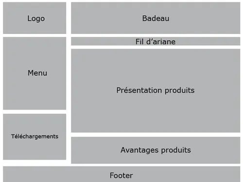

[#fourth_slide_cadrage]
= Cadrage

== cadrage

=== Atelier 1 : Vision

=== Atelier 2: Personas/Parcours utilisateurs

=== Atelier 3: Zoning, Storyboard, Sitemap

==== 1. Zoning

link:06_exercice_topic_presentation_slide_03.adoc#third_slide_cadrage[[<-\]]
link:06_exercice_topic_presentation_slide_05.adoc#fifth_slide_cadrage[[->\]]