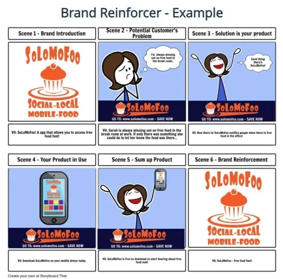

[#fifth_slide_cadrage]
= Cadrage

== cadrage

=== Atelier 1 : Vision

=== Atelier 2: Personas/Parcours utilisateurs

=== Atelier 3: Zoning, Storyboard, Sitemap
==== 1. Zoning
==== 2. StoryBoard

link:06_exercice_topic_presentation_slide_04.adoc#fourth_slide_cadrage[[<-\]]
link:06_exercice_topic_presentation_slide_06.adoc#sixth_slide_cadrage[[->\]]
