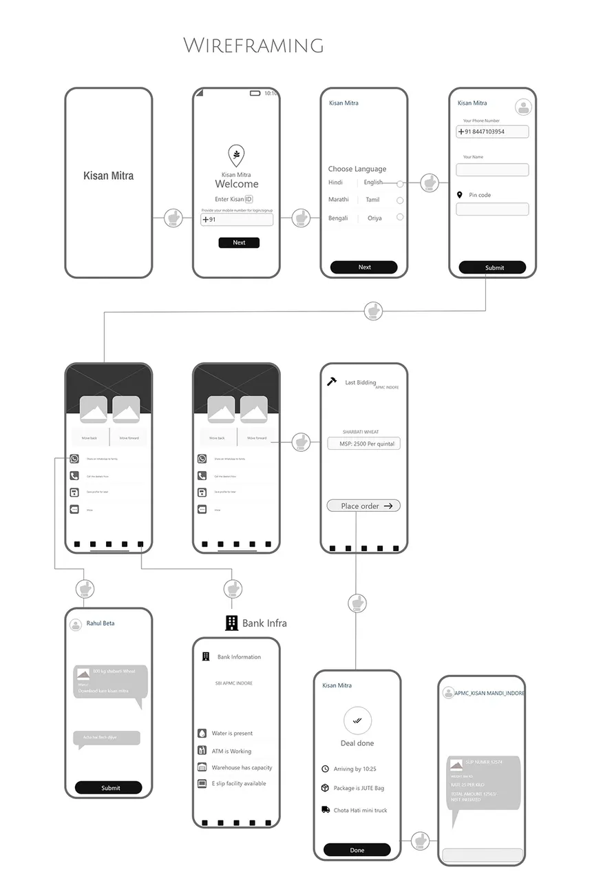
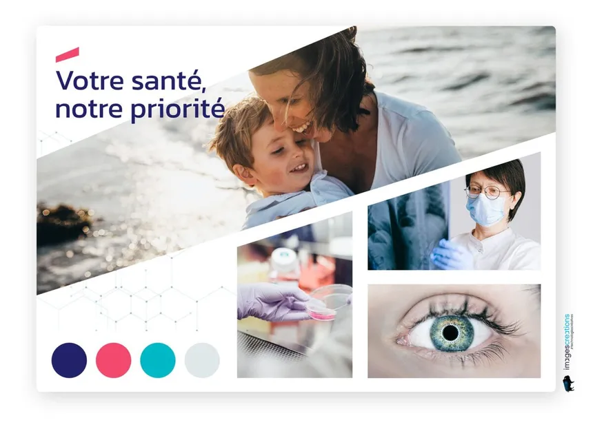

[#seventh_slide_cadrage]
= Cadrage

== cadrage

=== Atelier 1 : Vision

=== Atelier 2: Personas/Parcours utilisateurs

=== Atelier 3: Zoning, Storyboard, Sitemap

=== Atelier 4: Wireframe/Moodboard
==== 1. Wireframes

==== 2. Moodboard

link:06_exercice_topic_presentation_slide_06.adoc#sixth_slide_cadrage[[<-\]]
link:06_exercice_topic_presentation_slide_08.adoc#eighth_slide_cadrage[[->\]]